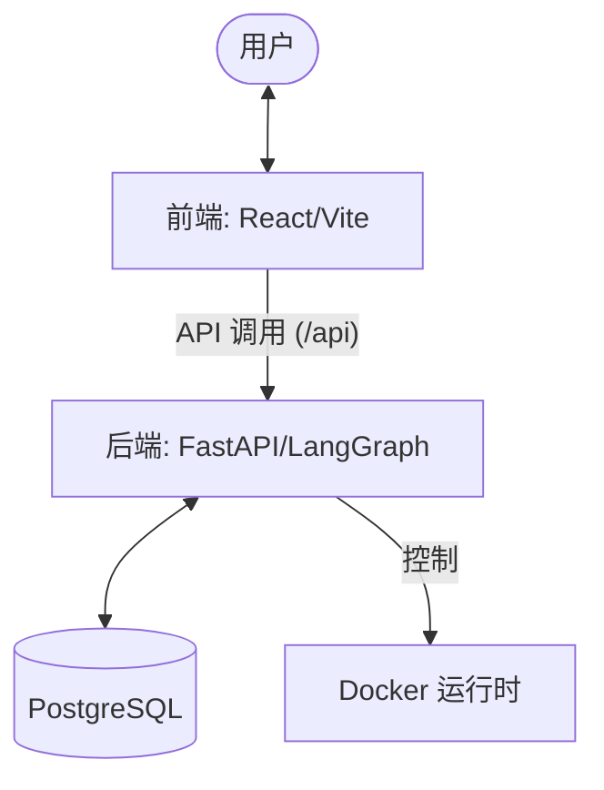

# OpenWebPX 架构概览

本项目 (Aegra) 采用全栈分离的 Monorepo 架构。

## 1. 整体架构 (High-Level Architecture)

## 2. 模块职责 (Responsibilities)

### 前端 (`web/`)
- **技术栈**: React 19, TypeScript, Vite, Tailwind CSS 4.
- **职责**: 用户交互界面、状态管理、与后端 API 通信。
- **部署**: 独立 Nginx 镜像。

### 后端 (`app/`, `graphs/`)
- **技术栈**: Python 3.12, FastAPI, LangGraph, SQLAlchemy.
- **职责**: 业务逻辑编排、Agent 状态管理、沙箱环境调度、数据库访问。
- **部署**: 独立 Python 镜像。

## 3. 开发环境配置

### 前后端联调
- 前端通过 Vite 代理 (`/api`) 将请求转发至后端 `localhost:8000`。
- 环境变量 `VITE_API_BASE_URL` 用于配置生产环境下的后端地址。

### 容器化部署
- 使用 `docker-compose.yml` 同时启动 `postgres`, `aegra` (后端) 和 `web` (前端) 服务。
- 前端 Nginx 配置已预设 `/api/` 路由转发至后端容器。
