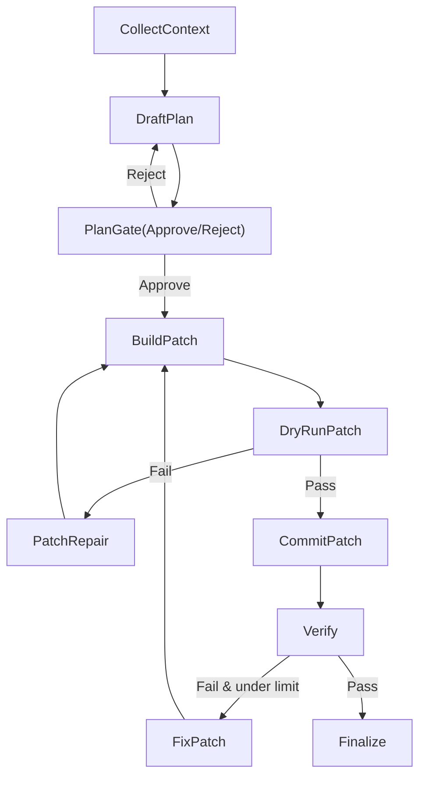

# Build App Agent V2：Kernel V1 底层架构设计

本文档定义 `build_app_agent_v2` 向 Codex 风格代理演进的最小可落地内核（Kernel V1）。

目标不是“增加工具数量”，而是把现有能力收束为少量原语，并用严格状态机和结构化协议获得可预测性、可审计性与可回归优化能力。

---

## 1. 设计目标

1. 将代理能力统一为 4 类原语：
   - 终端执行（Terminal）：`exec_command` / `write_stdin`
   - 代码修改（Patch）：`apply_patch`
   - 资源检索（Resource）：`list_resources` / `read_resource`
   - 计划跟踪（Plan）：`update_plan`
2. 将“计划”与“执行”做物理隔离，禁止边思考边写入。
3. 将补丁应用改为原子事务，杜绝部分提交。
4. 将工具返回改为结构化结果，杜绝字符串错误歧义。
5. 将运行指标内建到状态，支持 A/B 评估与迭代。

---

## 2. 非目标

1. 本阶段不引入额外模型训练或自定义推理服务。
2. 本阶段不要求一次性替换全部旧图，仅先让 `build_app_agent_v2` 切换到新内核。
3. 本阶段不强依赖复杂多智能体协作，仅保留单代理闭环。

---

## 3. 分层架构（从底层到上层）

### 3.1 L0：模型执行层（Model Runtime）

- 职责：
  - 生成计划、补丁、修复动作。
  - 在固定采样策略下保证确定性输出。
- 约束：
  - 执行阶段使用低随机参数（如低温度）。
  - 每轮写入前必须有已激活计划（Plan Token）。
- 产物：
  - 标准化消息与工具调用请求。

### 3.2 L1：内核协议层（Kernel Protocol）

- 核心对象：
  - `KernelToolCall`
  - `KernelToolResult`
  - `KernelEvent`
- 统一返回契约：
  - `ok: bool`
  - `error_code: str | null`
  - `message: str`
  - `details: object | null`
  - `retryable: bool`
- 原则：
  - 任何失败必须 `ok=false` 且带 `error_code`。
  - 禁止以 `"Error: ..."` 字符串模拟失败。

### 3.3 L2：状态机与模式控制层（Mode Controller）

- 模式：
  - `PLAN_MODE`：只读，不允许写工具。
  - `ACT_MODE`：允许写工具与验证工具。
- 强约束：
  - `PLAN_MODE` 可用工具：Resource + Plan
  - `ACT_MODE` 可用工具：Resource + Plan + Patch + Terminal
- 状态迁移：
  - 仅当 `plan.status == approved` 才允许进入 `ACT_MODE`。
  - 执行中若目标文件集合变更，回退 `PLAN_MODE` 并重新审批。

### 3.4 L3：补丁事务层（Patch Transaction Engine）

- 两阶段提交：
  1. `dry_run`：解析与全量匹配检查
  2. `commit`：全部通过后统一写入
- 语义：
  - 任一文件 hunk 不可定位即整体失败，不写入任何文件。
  - 结果返回包含 `matched_files`, `changed_files`, `hunks_applied`, `rollback=false/true`。

### 3.5 L4：资源层（Resource Layer）

- 统一入口：
  - `list_resources(scope)`
  - `read_resource(uri, slice)`
- 演进方向：
  - 首期兼容文件资源。
  - 二期接入 AST 资源：
    - `symbol://...`
    - `impl://...`
    - `callers://...`

### 3.6 L5：验证与自纠错层（Verifier Loop）

- 写后必须验证：
  - 依据改动类型选择最小验证集。
- 失败处理：
  - 进入修复轮并限制次数。
  - 超出阈值后退出并输出人工接管建议。

### 3.7 L6：可观测性层（Telemetry）

- 关键指标：
  - `tool_calls_total`
  - `patch_first_pass_rate`
  - `verify_fail_rate`
  - `repair_rounds`
  - `blocked_unplanned_writes_total`
  - `avg_latency_per_round_ms`
- 指标写入：
  - 每轮写入 `kernel_metrics` 到 graph state。
  - runtime/debug API 输出摘要字段。

---

## 4. 核心状态结构（State Schema）

```json
{
  "kernel": {
    "mode": "PLAN_MODE | ACT_MODE",
    "round": 0,
    "max_rounds": 0
  },
  "plan": {
    "version": 1,
    "summary": "",
    "target_files": [],
    "change_groups": [],
    "status": "draft | approved | superseded",
    "hash": ""
  },
  "execution": {
    "writes_per_file_total": {},
    "verify_attempts": 0,
    "repair_attempts": 0,
    "last_error_code": null
  },
  "resources": {
    "read_set": [],
    "resource_queries_total": 0
  },
  "metrics": {
    "tool_calls_total": 0,
    "patch_first_pass_rate": 0.0,
    "verify_fail_rate": 0.0
  },
  "ledger": []
}
```

---

## 5. 工具协议（V1）

### 5.1 Terminal

- `exec_command`
  - 入参：`cmd`, `workdir`, `timeout_ms`
  - 出参：`exit_code`, `stdout`, `stderr`, `duration_ms`
- `write_stdin`
  - 入参：`session_id`, `chars`
  - 出参：`exit_code?`, `output`

### 5.2 Patch

- `apply_patch`
  - 入参：`patch_content`, `dry_run=false`
  - 出参：
    - `ok`
    - `error_code`
    - `matched_files`
    - `changed_files`
    - `hunks_applied`
    - `details`

### 5.3 Resource

- `list_resources`
  - 入参：`scope`, `kind`
  - 出参：`items`
- `read_resource`
  - 入参：`uri`, `offset`, `limit`
  - 出参：`content`, `metadata`

### 5.4 Plan

- `update_plan`
  - 入参：`summary`, `target_files`, `change_groups`, `status`
  - 出参：`version`, `hash`, `status`

---

## 6. 错误码规范（V1）

- `PLAN_MISSING`
- `PLAN_NOT_APPROVED`
- `PLAN_FILESET_MISMATCH`
- `PATCH_PARSE_ERROR`
- `PATCH_AMBIGUOUS_MATCH`
- `PATCH_NO_MATCH`
- `PATCH_PARTIAL_FORBIDDEN`
- `RESOURCE_NOT_FOUND`
- `RESOURCE_ACCESS_DENIED`
- `VERIFY_FAILED`
- `EXEC_TIMEOUT`
- `INTERNAL_ERROR`

要求：

1. 所有工具失败必须落入以上错误码集合或其扩展前缀。
2. 错误码必须稳定，避免用自然语言字符串做逻辑分支。

---

## 7. 图执行流程（StateGraph）



节点约束：

1. `DraftPlan`/`PlanGate` 阶段禁写。
2. `CommitPatch` 是唯一写入节点。
3. `FixPatch` 仅在验证失败时进入。

---

## 8. 验证策略矩阵（V1）

| 改动类型 | 必跑验证 | 可选验证 |
|---|---|---|
| Python 业务代码 | `uv run ruff check <affected>` | `uv run pytest <affected>` |
| 路由/中间件 | `uv run ruff check <affected>` + 定向 `pytest` | 全量 `pytest` |
| 前端样式/组件 | 对应 lint/build 命令 | 预览探针 |
| 文档 | 跳过代码验证 | 链接检查 |

策略规则：

1. 验证命令由执行节点自动选择，不依赖模型自由发挥。
2. 验证失败必须产出结构化失败对象并进入修复策略。

---

## 9. 与当前实现的映射关系

当前已具备：

1. V4A 补丁能力与写前计划门禁。
2. `ls/glob` 限流与反抖动 guard。
3. 工具阶段降噪提示词约束。
4. 显式 Plan/Act `StateGraph` 物理隔离（`plan -> act`）。
5. Resource 抽象层 + AST 资源工具（`get_implementation`、`find_callers`）。

仍需补齐：

1. 验证策略自动选择与硬门禁。
2. 指标基准与 A/B 自动评估闭环。

---

## 10. 迁移路线（建议 4 个迭代）

### 迭代 1：协议与状态打底

1. 引入统一 `KernelToolResult` 结构。
2. `apply_patch` 改为 `dry_run + commit` 双阶段接口。
3. 在 state 中落 `plan/hash/mode/metrics` 字段。

### 迭代 2：StateGraph 化

1. 将 `create_agent + middleware` 迁为显式节点图。
2. 实现 `PlanGate` 中断与恢复。
3. 将写工具仅注入执行节点。

### 迭代 3：资源抽象升级

1. 增加 `list_resources/read_resource` 包装层。
2. 首批 AST 资源工具：`get_implementation`, `find_callers`。
3. 以资源 URI 取代散乱路径搜索。

### 迭代 4：评估闭环

1. 输出关键运行指标到 runtime/debug API。
2. 建立固定 benchmark 任务集。
3. A/B 对比旧版 `build_app_agent_v2` 与 Kernel V1。

---

## 11. 验收标准（Definition of Done）

1. 同一任务多文件补丁要么全部成功，要么全部不落盘。
2. 未审批计划无法触发任何写入动作。
3. 运行日志中无字符串型“伪错误协议”分支。
4. 平均工具调用次数与重复读写率显著下降。
5. 在固定回归集上，首轮补丁成功率稳定提升。
